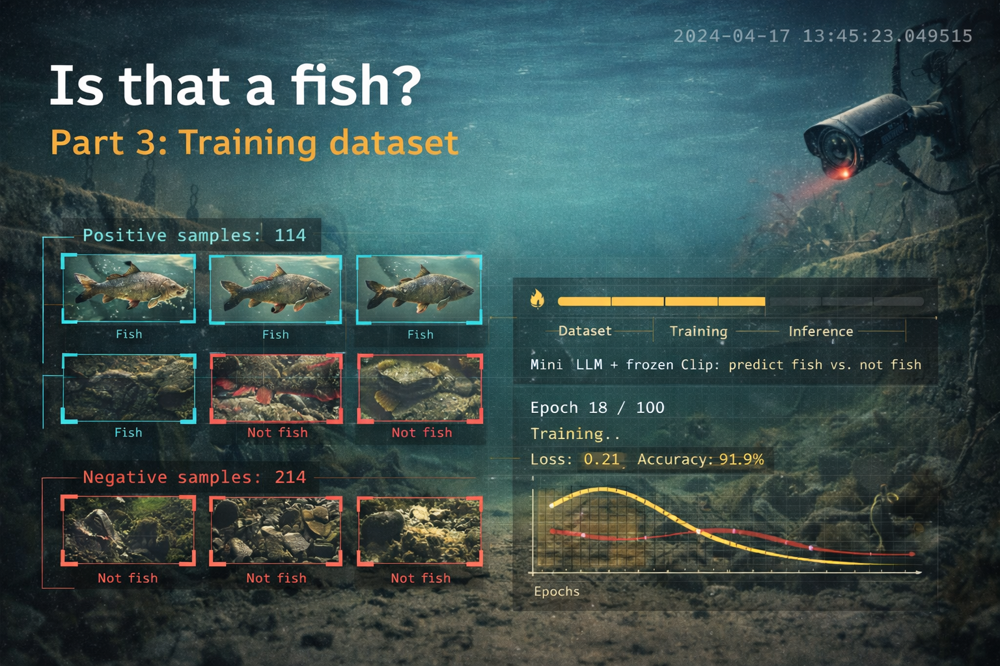

{ .md-banner }

<!--MD_POST_META:START-->

<!--MD_POST_META:END-->

# Fine-tuning a Vision LLM on Your Own Data: A Practical Guide

*How we taught IBM Granite Vision to recognize fish in an underwater camera feed, without a data center.*

---

## The Problem with Prompt Engineering

When you first connect a vision model to a real-world detection task, prompt engineering feels like magic. You write "Is there a fish in this image? Answer yes or no." and it works, sometimes. But as your use case gets more specific, prompting hits a ceiling.

The model was trained on the whole internet. It has a general idea of what a fish looks like, but it has never seen the murky, low-contrast footage of your specific riverbed camera. It doesn't know that the sediment clouds and water shimmer are *not* fish. It doesn't know the particular shapes and colors of the species that swim through your stream.

Fine-tuning is how you close that gap.

---

## What Is Fine-Tuning?

A large language model (or vision-language model) is pre-trained on massive, general datasets. Fine-tuning takes that pre-trained model and continues training it on a small, curated dataset specific to your task.

Think of it like this: the base model is a university graduate with broad knowledge. Fine-tuning is on-the-job training. You don't retrain them from scratch, you just teach them the specifics of your particular job.

In this case: show the model hundreds of labeled frames from the Visdeurbel stream, each tagged as "fish" or "no fish," and it learns the visual patterns that distinguish them in *this specific context*.

---

## Why Not Just Fine-Tune the Whole Model?

Granite Vision 3.2-2B has about 2 billion parameters. Training all of them would require:

- A multi-GPU setup (think: 4× A100s, ~$10/hour in the cloud)
- Days of training time
- Saving a 4+ GB checkpoint

For most practical fine-tuning tasks, you don't need this. Enter **LoRA**.

---

## LoRA: Fine-Tuning Without Full Retraining

**LoRA** stands for *Low-Rank Adaptation*. The core idea is elegant:

Instead of updating all the weights in the model's attention layers, you inject small *adapter matrices* alongside them. These adapters are tiny, maybe 0.3% of the total parameters, but they're enough to shift the model's behavior significantly for your task.

Here's the math intuition: a weight matrix `W` (say, 4096×4096) has millions of parameters. LoRA approximates the *change* to that matrix as a product of two smaller matrices:

```
ΔW ≈ A × B
     (4096×16) × (16×4096)
```

Where 16 is the **rank** (`r`). You only train `A` and `B`. The original `W` stays frozen.

The savings are dramatic:
- Full fine-tune: ~400M parameters to train
- LoRA (rank=16): ~2M parameters to train

And crucially: the LoRA adapter is a separate file (~50–200 MB) that sits on top of the base model. You can share it, version it, and swap it in/out at runtime.

---

## QLoRA: Making It Fit on a Consumer GPU

LoRA reduces the *trainable* parameters, but you still need to load the full model into GPU memory to do the forward pass. For a 2B model in 16-bit precision, that's ~4 GB of VRAM, which is tight on most consumer cards.

**QLoRA** adds one more trick: quantize the base model weights to **4-bit** before loading. The model weights are compressed from 16 bits to 4 bits per parameter using a format called NormalFloat4 (NF4), which is optimized for the distribution of neural network weights.

The result: the 2B model fits in ~3–4 GB of VRAM. Combined with LoRA's small adapter, you can fine-tune Granite Vision on a single consumer GPU with 12 GB VRAM (e.g., RTX 3060/3080/4070).

The training computation still happens in bfloat16 precision, only the stored weights are quantized.

---

## Our Dataset

I collected labeled frames directly from the Visdeurbel stream over several weeks. Two categories:

- **`images/fish/`** — frames where a fish is clearly visible (true positives from the existing detection pipeline, manually verified)
- **`images/no_fish/`** — frames that triggered the motion detector but contained no fish (false positives: sediment clouds, light changes, plant movement)

Images are 640×360 JPEG, the same resolution the stream is processed at.

I used an 80/20 train/validation split (see `prepare_dataset.py`), with random shuffling seeded for reproducibility.

Even 100–200 labeled images per class is enough to meaningfully shift model behavior. More is better, but the returns diminish past a few hundred.

---

## The Training Setup

### Model: `ibm-granite/granite-vision-3.2-2b`

IBM's Granite Vision is a compact (2B parameter) vision-language model built for instruction following. It's based on the LLaVA-Next architecture: a visual encoder (processes the image into tokens) feeds into a language model backbone (generates text). LoRA is applied only to the language backbone, the vision encoder stays frozen.

#### Why Granite Vision specifically?

A few reasons made it the right fit for this project:

**1. Edge-first design.** IBM explicitly builds the Granite model family with edge and on-device deployment in mind. The 2B size is not an accident, it's a deliberate target that enables inference on consumer hardware, embedded systems, and local servers without cloud dependency. For a camera system that runs 24/7 on a Raspberry Pi or a small home server, that matters a lot. We're already running it locally via llama.cpp in Docker, so a fine-tuned version stays in the same deployment model.

**2. It runs on commodity hardware.** The model supports quantization out of the box (llama.cpp, Ollama, LM Studio). The Q4_K_M quantized version is ~1.55 GB and runs comfortably on a machine without a dedicated GPU. That's the same machine the stream monitoring runs on.

**3. It punches above its weight on vision tasks.** Despite being 2B parameters, Granite Vision outperforms several larger models in its class on document and visual QA benchmarks (DocVQA: 0.89, ChartQA: 0.87, TextVQA: 0.78). For a binary yes/no task on consistent underwater footage, a model this capable is more than sufficient.

**4. Apache 2.0 licensed.** No usage restrictions, no API costs, no data leaving your network. The labeled footage from a private stream stays private.

**5. IBM's roadmap includes edge deployment tooling.** IBM is actively building out the Granite ecosystem for enterprise edge use cases, meaning future hardware acceleration, optimized runtimes, and integration with tools like [InstructLab](https://github.com/instructlab/instructlab) for further fine-tuning will all target this model family.

### Task framing

Each training sample is formatted as a chat conversation, using the same prompt that runs in production:

```
User: [image] You are reviewing a frame from a low-visibility underwater
      monitoring camera to decide whether a fish is visible.
      ...
      Reply with exactly one word: YES or NO
Assistant: YES
```

The prompt used during training must match the one used at inference time. If the model learns to respond to one question and is asked a different one in production, the fine-tuning doesn't transfer. In this project that means using the v8 prompt, the same one in `verifier.py` and `train.py`, consistently throughout.

### Key hyperparameters

| Parameter | Value | Why |
|-----------|-------|-----|
| `lora_rank` | 16 | Balances capacity vs. efficiency; 8 for very small datasets, 32 for larger |
| `lora_alpha` | 32 | Scaling factor = 2× rank is a common starting point |
| `lora_dropout` | 0.05 | Light regularization to prevent overfitting on small datasets |
| `learning_rate` | 2e-4 | Standard for LoRA; higher than full fine-tune because adapters train from random init |
| `epochs` | 3 | Enough for a small dataset; watch val loss to catch overfitting |
| `batch_size` | 1 + grad_accum=4 | Effective batch of 4; keeps VRAM usage low |
| `max_seq_len` | dynamic | SFTTrainer pads to the longest sample in each batch, no fixed limit needed |

---

## Running the Training Pipeline

### 1. Install dependencies

```bash
cd model-tuning
pip install -r requirements.txt
```

### 2. Add your images

```
model-tuning/
└── images/
    ├── fish/      ← copy fish frames here
    └── no_fish/   ← copy false-positive frames here
```

You can copy directly from the main project's `snapshots/` folder:
```bash
cp ../snapshots/fish/*.jpg images/fish/
cp ../snapshots/false/*.jpg images/no_fish/
```

### 3. Prepare the dataset

```bash
python prepare_dataset.py
```

Output:
```
  fish images   : 120
  no_fish images: 85

Dataset written to dataset/
  train: 164 samples  (96 fish, 68 no_fish)
  val  :  41 samples  (24 fish, 17 no_fish)
```

### 4. Train

```bash
python train_fast.py
```

You'll see output like:
```
GPU: NVIDIA GeForce RTX 5070 Ti (16.0 GB)
VRAM cap: 75% = 12.0 GB
Train samples: 324
Loading ibm-granite/granite-vision-3.2-2b in fp16...
trainable params: 11,505,664 || all params: 2,986,902,592 || trainable%: 0.3852
Starting training (no eval pauses, ~40 min)...
{'loss': 0.4821, 'epoch': 1.0}
{'loss': 0.3244, 'epoch': 2.0}
{'loss': 0.2486, 'epoch': 3.0}
...
LoRA adapter saved to output/granite-fish-lora-fast/
```

Training 324 samples for 3 epochs takes roughly **40 minutes** on a consumer GPU with 16 GB VRAM. Note: `train_fast.py` skips validation during training, run evaluation separately in step 5.

### 5. Evaluate

```bash
# Compare base model vs fine-tuned on your validation set
python inference.py --eval --no-adapter   # base model
python inference.py --eval                # fine-tuned
```

### 6. Test on a single image

```bash
python inference.py path/to/frame.jpg
# Result: yes
```

---

## Results

After training on **101 fish / 303 not-fish** frames (324 train, 80 val), the fine-tuned adapter achieved:

| Metric | Score |
|--------|-------|
| **Accuracy** | 94.6% |
| **Precision** | 88.9% |
| **Recall** | 88.9% |
| **F1** | 88.9% |

Confusion matrix on the 80-sample validation set:

```
TP=16  FP=2  TN=54  FN=2
```

Only 4 mistakes out of 74 evaluated samples, 2 false positives (non-fish frames called fish) and 2 false negatives (fish frames missed). For a stream monitoring system where the LLM verifier is already one layer of filtering, this is a solid result with a relatively small dataset.

## Interpreting the Results

When evaluating fish detection, **recall matters more than precision**. Missing a fish (false negative) means a missed notification. Flagging a non-fish frame (false positive) just means a slightly annoying extra Telegram message that gets filtered by the LLM verifier downstream.

| Metric | What it means for us |
|--------|---------------------|
| **Accuracy** | Overall correct rate, good headline number |
| **Precision** | Of frames we called "fish", how many really were? |
| **Recall** | Of all fish frames, how many did we catch? |
| **F1** | Harmonic mean of precision and recall, use this to compare models |

With 200+ labeled fish samples, F1 > 0.90 should be achievable.

---

## Integrating the Adapter with the Production Pipeline

The fine-tuned LoRA adapter is a drop-in replacement for the base model in `verifier.py`. The only change needed is to load the adapter on top of the base model before serving:

```python
from peft import PeftModel

model = LlavaNextForConditionalGeneration.from_pretrained(BASE_MODEL_ID, ...)
model = PeftModel.from_pretrained(model, "model-tuning/output/granite-fish-lora")
```

Alternatively, serve it via Ollama or llama.cpp (the same runtime used in the Docker setup) by merging the adapter weights back into the base model and converting to GGUF:

**Step 1 - merge the adapter into the base model weights:**
```python
merged = model.merge_and_unload()
merged.save_pretrained("output/granite-fish-merged")
processor.save_pretrained("output/granite-fish-merged")
```

**Step 2 - convert to GGUF using llama.cpp's conversion script:**
```bash
git clone https://github.com/ggerganov/llama.cpp
pip install -r llama.cpp/requirements/requirements-convert_hf_to_gguf.txt
python llama.cpp/convert_hf_to_gguf.py output/granite-fish-merged \
    --outfile output/granite-fish-merged.gguf \
    --outtype q4_k_m
```

This produces a quantized GGUF file you can drop straight into the existing `Dockerfile.llm`. Replace the `wget` download lines with a `COPY` of your local file. The rest of the Docker setup, llama-server, and `verifier.py` are unchanged.

---

## Online Alternatives: Labeling and Training in the Browser

If running training locally isn't an option, because the hardware is too weak, there's no GPU, or you just don't want your PC tied up for hours, several platforms let you upload your images, label them visually, and either train a model directly or export code you can run elsewhere. Here are the most useful ones for a project like this.

---

### Roboflow

[Roboflow](https://roboflow.com) is the most complete end-to-end platform for computer vision datasets. You upload images, annotate them in the browser (bounding boxes, polygons, or classification labels), and it handles dataset versioning, augmentation, and export.

For a binary classification task like fish/no-fish, the workflow is:

1. Create a project → select **Image Classification**
2. Upload your frames from `snapshots/training-data/`
3. Label each image as `fish` or `not-fish` using the web UI
4. Apply augmentations (flip, brightness, crop) to multiply your dataset
5. Export as a HuggingFace dataset or download a Python snippet:

```python
from roboflow import Roboflow
rf = Roboflow(api_key="your_key")
dataset = rf.workspace("your-workspace").project("visdeurbel").version(1).download("folder")
```

Roboflow also has a **Train** tab that will fine-tune a classification model directly on their servers (free tier available). The resulting model is smaller and faster than Granite Vision but won't match a fine-tuned vision-language model for nuanced low-visibility footage.

**Best for:** Building and managing your labeled dataset, augmentation, quick iteration.

---

### Hugging Face AutoTrain

[AutoTrain](https://huggingface.co/autotrain) is HuggingFace's no-code training service. Since we're already using HuggingFace models, this is the most natural fit.

1. Go to [huggingface.co/autotrain](https://huggingface.co/autotrain)
2. Create a new project → **Image Classification**
3. Upload two folders: `fish/` and `not-fish/`
4. Select a base model, you can use `ibm-granite/granite-vision-3.2-2b` or a lighter classifier like `google/vit-base-patch16-224`
5. Configure epochs and learning rate
6. Click Train, it runs on HuggingFace's infrastructure

When done, the model is saved directly to your HuggingFace Hub repository. You can load it with the standard `transformers` library:

```python
from transformers import pipeline
classifier = pipeline("image-classification", model="your-username/visdeurbel-fish")
result = classifier("frame.jpg")
```

**Best for:** Training a full model without touching any code, directly on HuggingFace infrastructure. Free tier available for small models.

---

### Google Colab (free GPU notebook)

Not a labeling platform, but worth mentioning as the easiest way to run `train_fast.py` without tying up your local machine. Colab gives you a free T4 GPU (16 GB VRAM) for short sessions.

1. Open [colab.research.google.com](https://colab.research.google.com)
2. Upload your `dataset/` folder (train.jsonl + val.jsonl + images) to Google Drive
3. Mount Drive and run the training script:

```python
from google.colab import drive
drive.mount('/content/drive')

!pip install transformers peft trl pillow python-dotenv accelerate

# copy your train_fast.py and dataset here, then:
!python train_fast.py
```

Training 324 samples for 3 epochs takes ~40 minutes on a T4. Download the `output/` folder when done.

**Best for:** Running `train_fast.py` exactly as-is, on a free GPU, without locking up your machine.

---

### Label Studio (self-hosted, open source)

[Label Studio](https://labelstud.io) is an open-source labeling tool you can run locally or in Docker. It's more flexible than Roboflow for custom workflows, useful if you want to build a labeling pipeline directly into the Visdeurbel stack.

```bash
docker run -p 8080:8080 heartexlabs/label-studio
```

Open `localhost:8080`, create a classification project, and point it at your `snapshots/` folder. Annotators (or just you) label frames through the browser UI. Exports to JSON, CSV, or directly to a HuggingFace dataset.

**Best for:** Self-hosted labeling with no data leaving your network, important if the stream footage is private.

---

### Summary

| Platform | Labeling | Training | Free tier | Best for |
|----------|----------|----------|-----------|----------|
| **Roboflow** | Yes | Yes (limited) | Yes | Dataset management + augmentation |
| **HF AutoTrain** | No | Yes | Yes | No-code training on HF models |
| **Google Colab** | No | Yes | Yes | Running your own scripts on a free GPU |
| **Label Studio** | Yes | No | Yes (self-hosted) | Private data, custom workflows |

For this project, the recommended path is: **Label Studio** (or manual folder sorting) to label, **Google Colab** to train with `train_fast.py`, download the adapter, and deploy locally via Docker.

---

## What's Next

- **More data**, the single biggest lever. Every 2× increase in labeled samples improves accuracy.
- **Data augmentation**, horizontal flips, brightness jitter, and slight crops on the training images to improve robustness.
- **Active learning**, use the current model's uncertain predictions (near 50/50 confidence) to guide what to label next.
- **Rank tuning**, if overfitting is a problem, reduce `lora_rank` to 8. If the model plateaus early, try rank 32.

---

Written by [Matthias Blomme](https://www.linkedin.com/in/matthiasblomme/)

\#IBMChampion \
\#AppConnectEnterprise(ACE)
